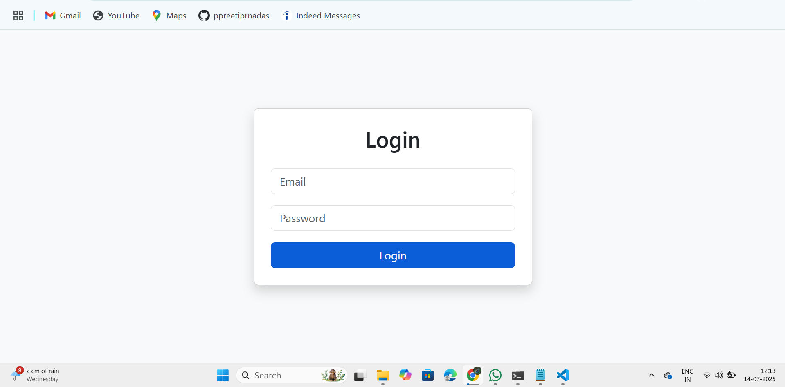
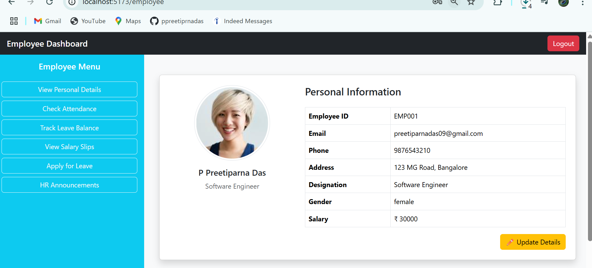
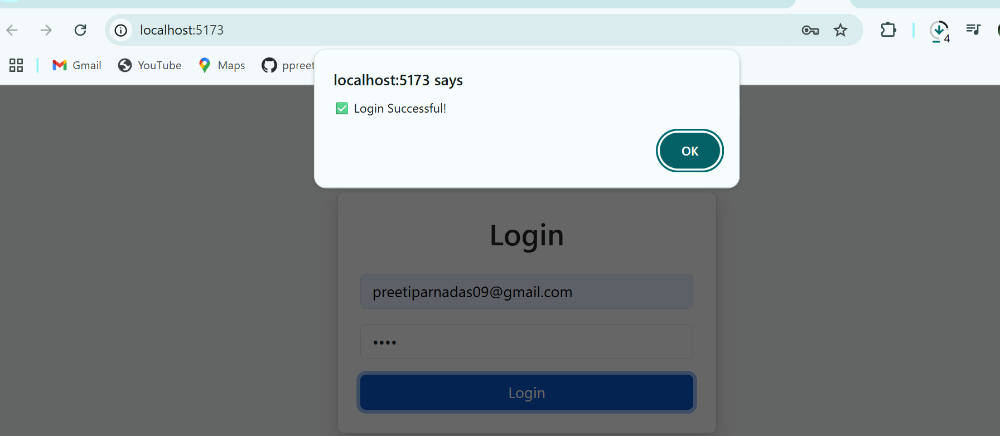
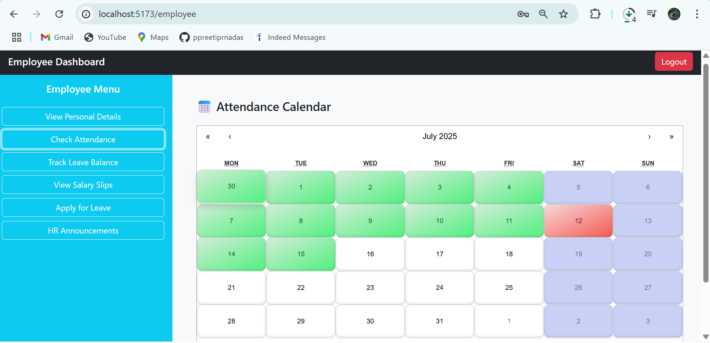
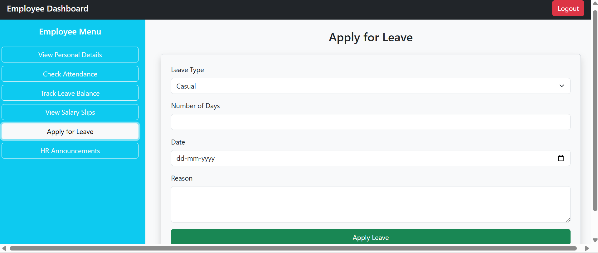
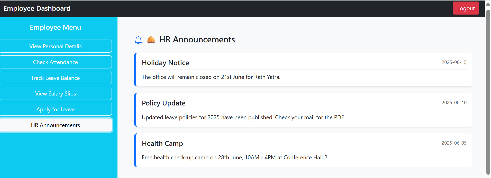
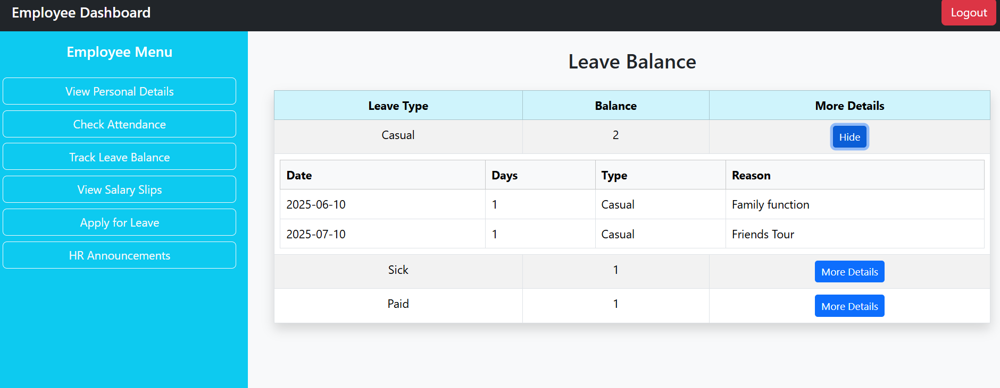
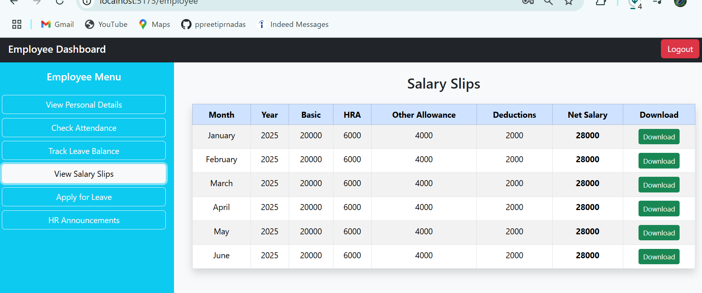
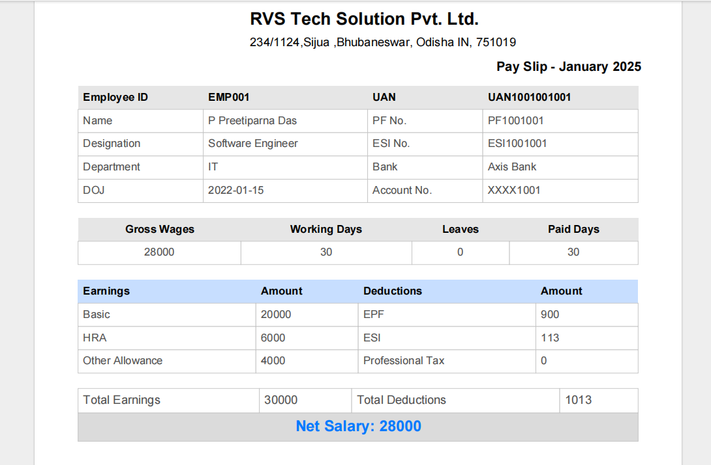

<h1 align="center">🧑‍💼 Employee Management System</h1>

<p align="center">
  A responsive and user-friendly Employee Management System built with <strong>React</strong>, <strong>Bootstrap</strong>, and <strong>Local JSON</strong> data.
</p>

<p align="center">
  
  
  
</p>

---

## 🚀 Project Overview

The **Employee Management System** is a fully functional frontend application designed to help employees manage their work-related activities such as:

- ✅ Logging in securely
- 👤 Viewing personal details
- 📅 Marking attendance through an interactive calendar
- 📝 Applying for leave
- 📊 Checking leave balances
- 💰 Viewing salary slips
- 📢 Reading HR announcements

> 🔒 All session and data state is maintained via localStorage to simulate backend interactions.

---

## ✨ Live Features Demo (Screenshots or GIF)

> You can upload your images in a /screenshots folder and use them here:

| 🔐 Login Page | 🏠 Employee Dashboard |
|--------------|-----------------------|
|  |  |

---

## 🛠 Tech Stack

| Technology | Description |
|-----------|-------------|
| ⚛️ React | Frontend library for building UI |
| 🧭 React Router | Page routing and navigation |
| 🎨 Bootstrap 5 | Styling and layout system |
| 📂 localStorage | Stores user session and form data |
| 📄 JSON | Used as employee data source |

---

## 📁 Project Structure

```bash
EMPLOYEE-APP/
├── node_modules/
├── public/
├── screenshot/
├── src/
│   ├── assets/
│   ├── components/
│   │   ├── dashboard/
│   │   │   ├── Announcements.jsx
│   │   │   ├── ApplyLeave.jsx
│   │   │   ├── Attendance.jsx
│   │   │   ├── LeaveBalance.jsx
│   │   │   ├── PersonalDetails.jsx
│   │   │   └── SalarySlips.jsx
│   │   ├── AdminDashboard.jsx
│   │   ├── EmployeeDashboard.jsx
│   │   └── Login.jsx
│   ├── data/
│   ├── styles/
│   │   └── App.css
│   ├── App.js
│   └── index.js


---

## 🧩 Major Functional Components

### 🔐 Login.jsx
- Validates user credentials from `employee.json`
- Stores user info in `localStorage`

### 🏠 EmployeeDashboard.jsx
- Renders all dashboard sections after login
- Handles logout with `localStorage.clear()`

### 📅 Attendance.jsx
- Uses `react-calendar` to mark attendance
- Stores attendance dates in `localStorage`

### 📝 ApplyLeave.jsx
- Users can apply for leave by submitting a form
- Leave records stored in `localStorage`

### 📊 LeaveBalance.jsx
- Displays remaining and total leave balance

### 💰 SalarySlips.jsx
- Displays hardcoded salary slip table

### 🔔 HRAnnouncements.jsx
- Shows dummy announcements (can be enhanced with backend)
---
## 🖼️ Application Screenshots

<h3>🔐 Login Page</h3>


---

<h3>✅ Login Success</h3>


---

<h3>🏠 Employee Dashboard</h3>


---

<h3>📅 Attendance Calendar</h3>


---

<h3>📝 Apply for Leave</h3>


---

<h3>🔔 HR Announcements</h3>


---

<h3>📊 Leave Balance</h3>


---

<h3>💰 Salary Slip</h3>


---

<h3>📄 Salary Slip PDF</h3>


---
## 💡 How to Use

### ✅ Prerequisites
- Node.js (v14+)
- npm

### 📦 Installation
bash
git clone https://github.com/PPreetiparnaDas/React-based-Employee-Management-System
cd employee-management-system
npm install
npm start
The app will open on [http://localhost:3000](http://localhost:5173/)

🎯 Key Learning Outcomes
🔄 React state and effect management (useState, useEffect)

🔁 Component-based architecture

📦 Using localStorage as mock backend

🌐 Single Page Application using react-router-dom

🎨 Bootstrap 5 layout design and responsiveness

✍️ Author
Preetiparna Das
Frontend Developer | React Enthusiast

GitHub: @PPreetiparnaDas

Email: preetiparnadas09@gmail.com

📌 Suggestions or Contributions?
Feel free to Fork this project and raise a Pull Request.
Your feedback and suggestions are most welcome!

If you liked this project, don’t forget to ⭐ the repo 😄

📄 License
This project is licensed under the MIT License – you're free to use, modify, and distribute this project.
